# 公司督办管理系统普通用户操作手册

| 项目 | 内容 |
|---|---|
| 系统名称 | 公司督办管理系统 |
| 文档名称 | 普通用户操作手册 |
| 版本号 | V1.0 |
| 编写日期 | 2026年7月2日 |
| 适用对象 | 部门事项管理岗 / 系统办理人、部门领导、公司主管领导、公司主要领导 |
| 使用说明 | 文中截图均为演示数据，与实际业务数据无关。 |

---

## 阅读前说明

### 适用范围

本手册面向普通业务用户，说明如何查看事项、创建事项、办理审批、处理退回、申请调整或取消、提交完成材料、查看附件和审批记录。

本手册适用以下角色：

- 部门事项管理岗 / 系统办理人；
- 部门领导；
- 公司主管领导；
- 公司主要领导。

本手册不包含系统管理员、督办管理员、全局管理、全局统计、导入导出等管理类功能。

### 重要概念

| 概念 | 用户应如何理解 |
|---|---|
| 系统办理人 | 系统中负责继续办理进行中事项的用户，例如申请调整、申请取消、提交完成材料。 |
| 业务责任人 | 页面展示、责任留痕使用的责任人信息，不代表一定拥有系统办理权限。 |
| 待我审批 | 当前事项正等待本人审批。 |
| 待我办理 | 当前事项需要本人继续处理，但不处于本人审批节点。 |
| 可查看 | 可以打开和查看事项，不等于可以修改、办理或审批。 |
| 草稿 | 尚未提交审批的事项。 |
| 待分解 | 公司领导发起待办后，等待主责部门补充分解方案。 |
| 进行中 | 已完成立项或分解审批，正在实施的事项。 |

> **提示：** 系统办理权限由系统中的用户关联决定；业务责任人主要用于页面展示和责任留痕。

### 第一版不包含的功能

- 系统管理；
- 督办管理；
- Excel 导入、导出和模板下载；
- 重点工作取消至公司主要领导最终审批的特殊流程。

---

## 1. 登录、修改密码与退出

### 1.1 登录系统

打开系统登录页面后，按以下步骤登录：

1. 输入用户名。
2. 输入密码。
3. 点击“登录”。

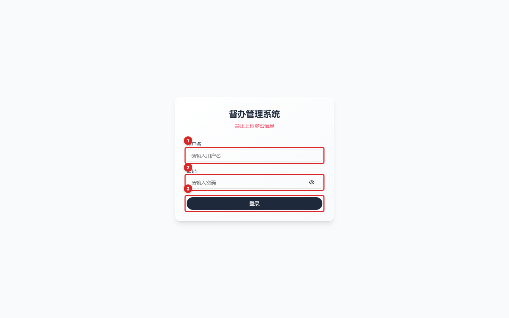

图 1-1 展示登录页面的用户名、密码输入框和“登录”按钮。登录前，密码输入框应保持空白，不在手册中展示任何密码。

### 1.2 修改密码与退出

登录后，在页面右上角可以看到当前用户信息，并可以使用“修改密码”和“退出”入口。

1. 点击“修改密码”，按页面提示修改本人密码。
2. 点击“退出”，结束当前登录会话。

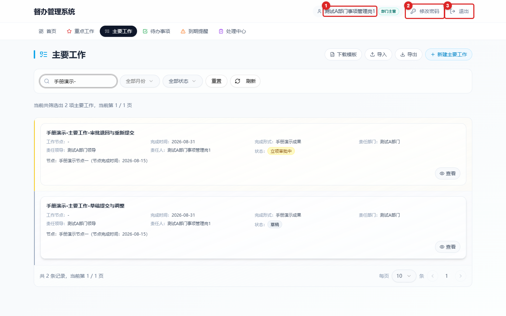

图 1-2 展示右上角用户区域中的“修改密码”和“退出”入口。日常离开系统前，建议先退出登录。

---

## 2. 首页概览与提醒

首页用于快速查看工作概况和待处理任务入口。首页不展开具体审批办理规则，审批和办理操作在后续章节说明。

首页通常包括：

- 事项统计卡片；
- 到期提醒；
- 待办理、待审批等处理入口；
- 进入重点工作、主要工作、待办事项列表的入口。

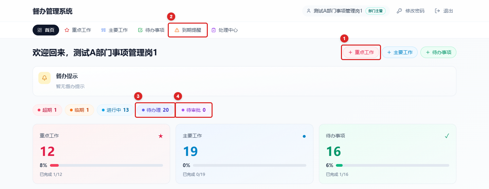

图 2-1 展示首页统计卡片、提醒入口和处理中心入口。用户可以通过这些入口快速进入事项列表或处理中心。

---

## 3. 查找和查看事项

### 3.1 按事项类型查看

系统将事项分为三类：

- 重点工作；
- 主要工作；
- 待办事项。

用户可以通过顶部导航进入对应列表，查看自己有权限查看的事项。

### 3.2 搜索和筛选事项

在事项列表中，可以通过关键词搜索事项，也可以按月份、状态等条件筛选。

常用操作包括：

1. 在搜索框输入事项关键词。
2. 选择月份条件。
3. 选择状态条件。
4. 点击“查看”进入事项详情页。

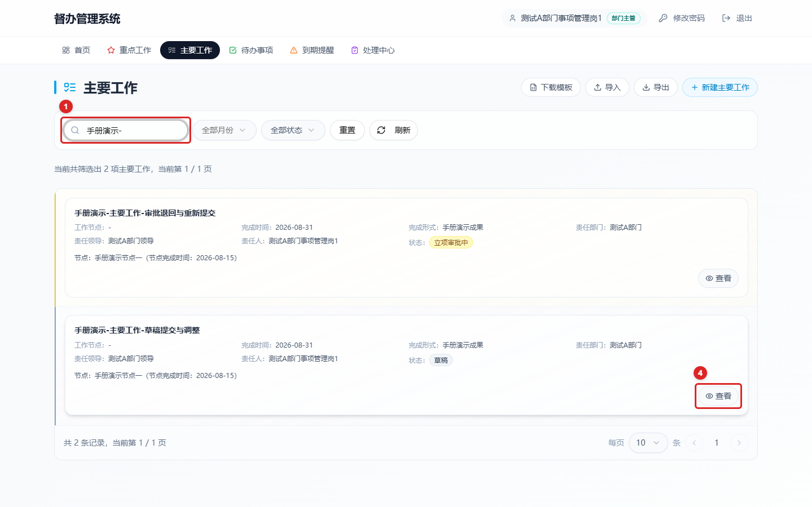

图 3-1 展示事项列表中的搜索框、月份筛选、状态筛选和“查看”入口。列表筛选可以帮助用户快速定位需要处理或查看的事项。

### 3.3 查看事项详情

进入事项详情页后，通常可以查看以下信息：

- 当前状态；
- 主责部门；
- 责任领导、责任人员等责任信息；
- 工作计划或任务节点；
- 普通附件；
- 完成材料；
- 审批记录。

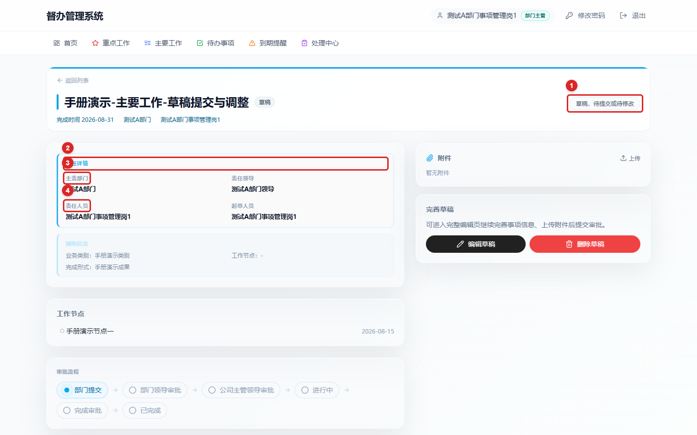

图 3-2 展示事项详情页中的状态、主责部门和责任信息。不同状态下，页面右侧或下方会显示不同的操作入口。

> **提示：** 能查看事项，不代表一定可以修改、办理或审批。

---

## 4. 新建事项前：选择事项类型

新建事项前，应先根据业务场景选择事项类型。

| 事项类型 | 常见适用场景 | 谁可以创建 | 流程特点 |
|---|---|---|---|
| 重点工作 | 公司级重点督办事项 | 部门事项管理岗、部门领导 | 正常立项、调整、取消、完成流程。 |
| 主要工作 | 部门主要工作事项 | 部门事项管理岗、部门领导 | 正常立项、调整、取消、完成流程。 |
| 待办事项 | 领导交办或日常待办事项 | 部门角色、公司领导 | 公司领导发起后需由主责部门进行分解。 |

第一版手册只说明普通高频流程，不展开特殊取消流程。

---

## 5. 新建事项并保存草稿

### 5.1 新建重点工作或主要工作

部门事项管理岗或部门领导可以进入对应类型的新建页面，填写事项基础信息并保存草稿。

常用步骤：

1. 进入重点工作或主要工作列表。
2. 点击新建入口。
3. 填写业务类别、工作事项、完成时间、完成形式等基础信息。
4. 选择责任部门、责任领导、业务责任人和系统办理人。
5. 根据需要填写工作节点。
6. 点击“保存草稿”。

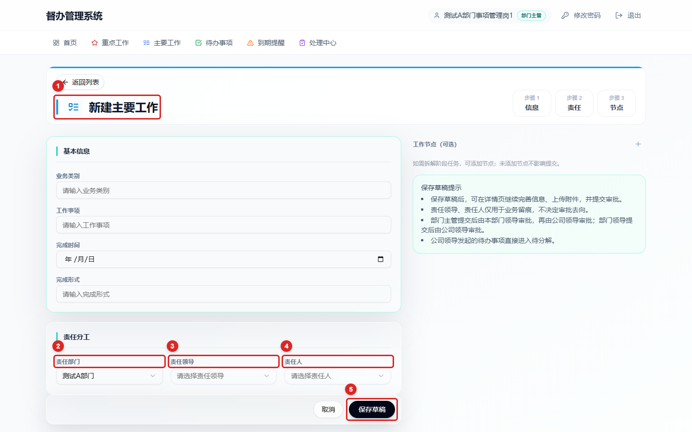

图 5-1 展示新建主要工作页面。用户应重点关注基础信息、责任分工和“保存草稿”按钮。

> **提示：** 业务责任人用于展示和责任留痕；系统办理人负责后续系统办理动作。两者可以是同一人，也可能不同。

### 5.2 查看已保存的草稿

草稿保存后，可以在详情页继续查看和完善。草稿状态下，用户可以继续编辑、保存或提交审批。

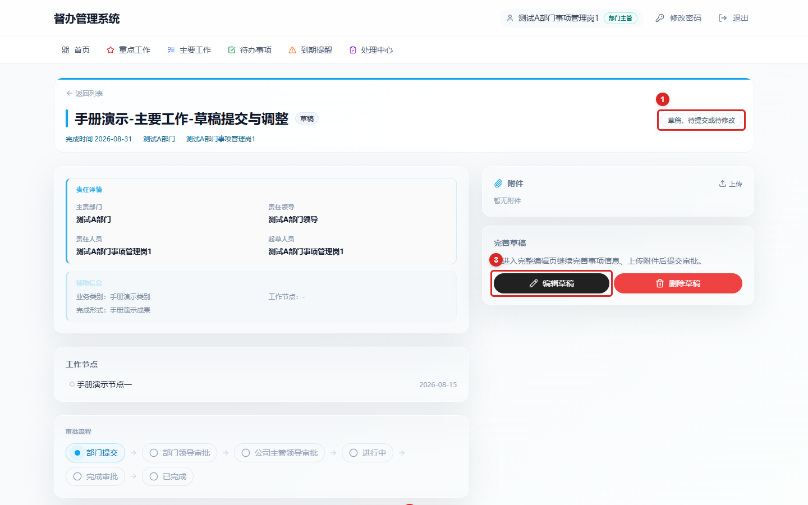

图 5-2 展示草稿详情页。草稿尚未进入审批流程，用户应在确认信息完整后再提交审批。

---

## 6. 编辑草稿并提交审批

### 6.1 编辑草稿

如果草稿内容需要补充或修改，可以进入编辑页面。

常用步骤：

1. 打开草稿事项详情页。
2. 点击编辑入口。
3. 修改需要调整的内容。
4. 点击保存按钮。

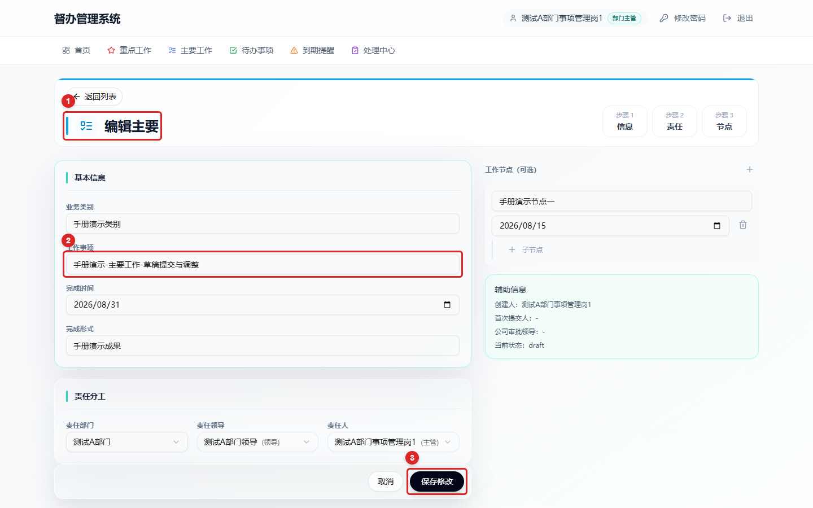

图 6-1 展示草稿编辑页面。用户可以在此修改基础信息、责任信息和节点信息。

### 6.2 提交审批

草稿信息确认无误后，可以提交审批。

实际操作步骤：

1. 在草稿详情页确认信息无误。
2. 点击“提交审批”。
3. 系统直接提交，并显示“已提交审批”提示。
4. 事项进入审批流程。

> **提示：** 提交审批时，系统不会显示额外的提交确认弹窗。请在点击“提交审批”前先确认信息完整、准确。

---

## 7. 公司领导发起待办与部门分解

### 7.1 公司领导发起待办

公司领导可以进入待办事项新建页面，填写待办事项内容。公司领导发起的待办事项提交后，会进入“待分解”，由主责部门补充分解方案。

常用填写内容包括：

- 事项提出领导；
- 事项提出场景；
- 工作计划；
- 进展情况；
- 待办事项；
- 完成时间；
- 主责部门和责任信息。

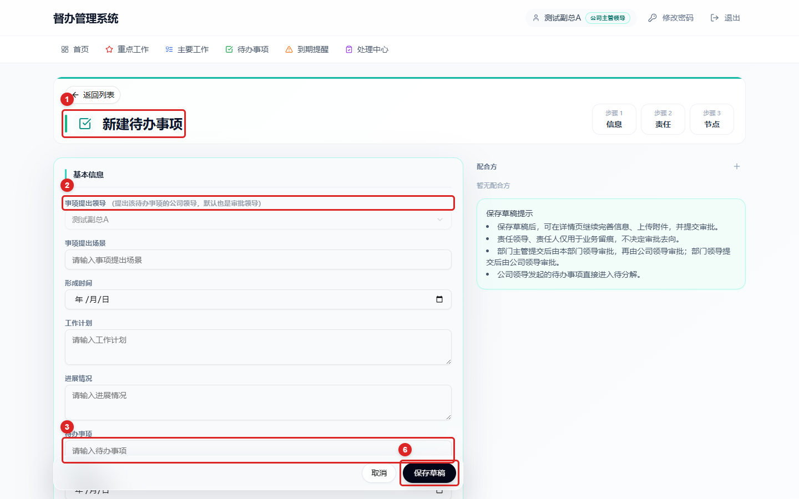

图 7-1 展示公司领导新建待办事项页面。用户应重点关注待办事项主要内容、主责部门和责任人选择区域。

### 7.2 主责部门查看待分解事项

公司领导发起待办后，主责部门可以在事项详情中看到“待分解”状态和分解办理区域。

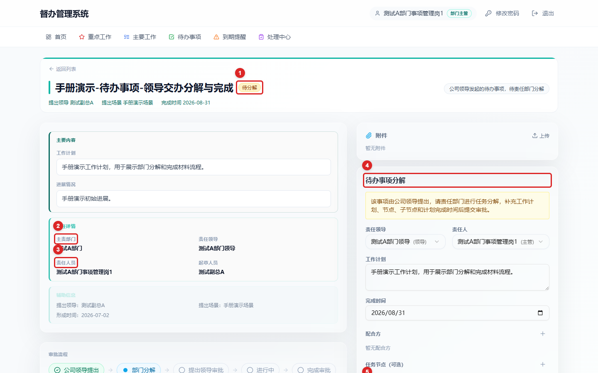

图 7-2 展示待分解事项详情页。主责部门应重点关注事项状态、责任信息和右侧的分解办理区。

### 7.3 填写并提交分解方案

主责部门办理人需要补充分解方案后提交。

已验证的填写规则：

- 工作计划必填；
- 完成时间必填；
- 至少一个任务节点必填；
- 提交按钮为“提交分解结果”。

常用步骤：

1. 确认责任领导和责任人。
2. 填写工作计划。
3. 填写完成时间。
4. 添加至少一个任务节点。
5. 点击“提交分解结果”。
6. 系统将分解方案提交审批。

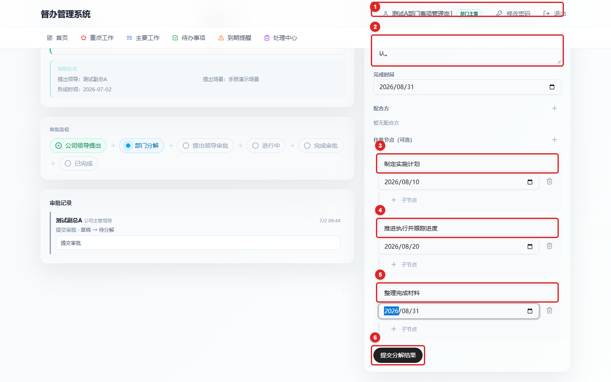

图 7-3 展示分解方案中的任务节点和“提交分解结果”按钮。提交后，事项进入审批流程。

---

## 8. 处理中心：待我审批与待我办理

处理中心用于集中查看需要本人处理的事项。不同标签含义不同，不能混用。

| 标签 | 含义 |
|---|---|
| 待我审批 | 当前事项正等待本人审批。 |
| 待我办理 | 当前事项需要本人继续办理，例如草稿编辑、待办分解、退回后修改、进行中办理。 |
| 全部事项 | 用于集中查看处理中心中的相关事项，不等于所有用户都能办理所有事项。 |

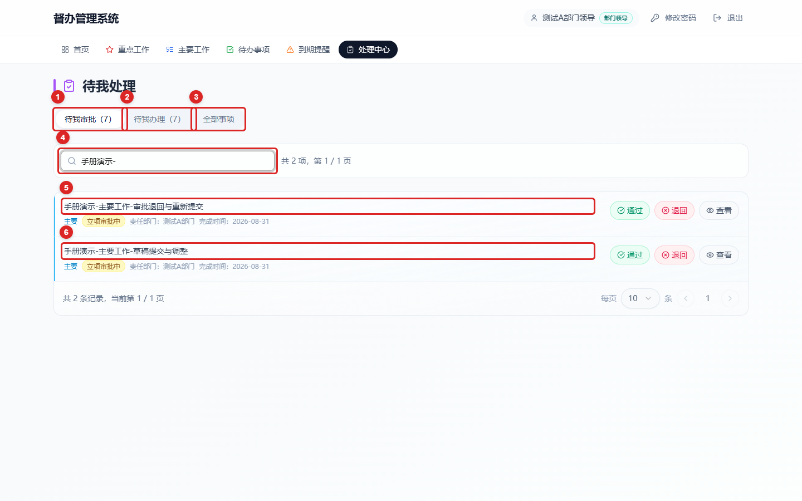

图 8-1 展示处理中心的“待我审批”“待我办理”“全部事项”标签。用户应先确认事项处于哪类处理任务，再执行对应操作。

> **提示：** 部门领导可以查看本部门相关事项，但只有事项进入本人审批节点时，才可以审批。

---

## 9. 审批通过与审批退回

### 9.1 审批通过

当事项进入本人审批节点时，详情页会显示审批操作区。审批通过时，可以填写审批意见。

常用步骤：

1. 打开待审批事项。
2. 查看事项内容和审批流程。
3. 点击“审批通过”。
4. 填写审批意见。
5. 点击“确认通过”。

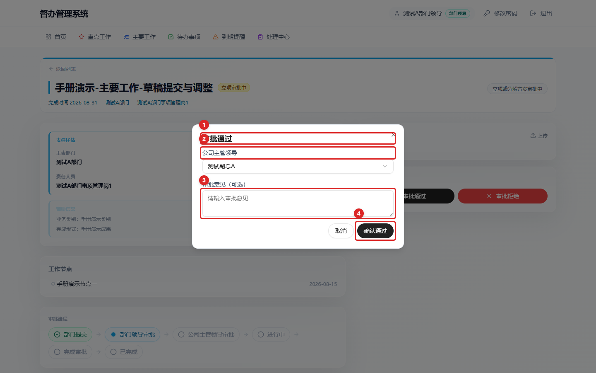

图 9-1 展示审批通过弹窗。部门领导审批后，系统可能进入公司主管领导审批；是否有下一审批节点，以页面当前实际显示为准。

### 9.2 审批退回

如果事项内容需要修改，审批人可以退回事项。

常用步骤：

1. 打开待审批事项。
2. 点击“审批拒绝”。
3. 按页面提示填写退回原因。
4. 提交后，事项回到可修改状态。
5. 退回原因会显示在事项详情中。

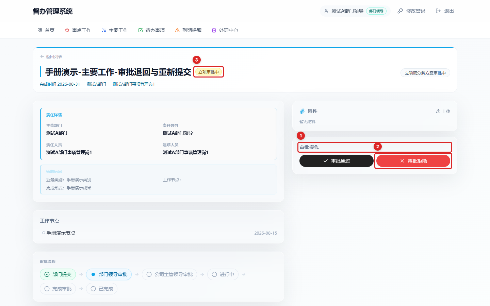

图 9-2 展示审批操作区中的退回入口。退回后，办理人需要根据退回原因修改并重新提交。

---

## 10. 退回后修改并重新提交

事项被退回后，系统指定的办理人可以查看退回原因，修改后重新提交。

操作步骤：

1. 打开被退回事项。
2. 查看退回原因。
3. 进入修改页面，调整事项内容。
4. 填写修改说明。
5. 点击“保存修改并重新提交”。

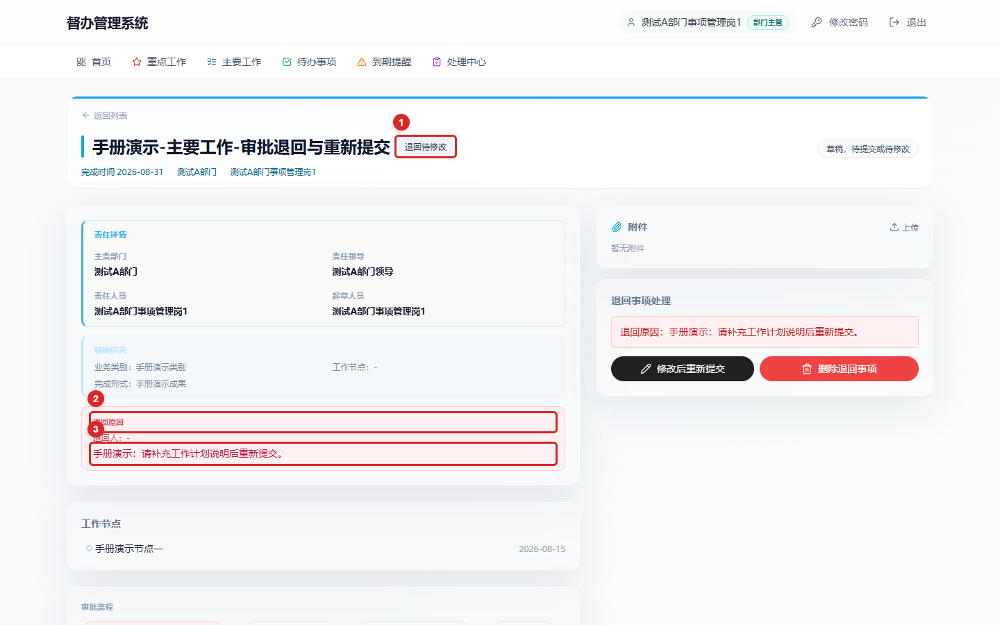

图 10-1 展示退回待修改状态、退回原因和重新提交入口。退回后应按审批意见补充或修正事项内容。

> **提示：** 退回后由系统指定的办理人继续处理。同部门其他用户即使可以查看，也不一定有重新提交权限。

---

## 11. 进行中事项办理

### 11.1 可办理操作

事项进入“进行中”后，系统办理人可以根据页面入口继续办理。

常见办理操作包括：

- 申请调整；
- 申请取消；
- 提交完成材料。

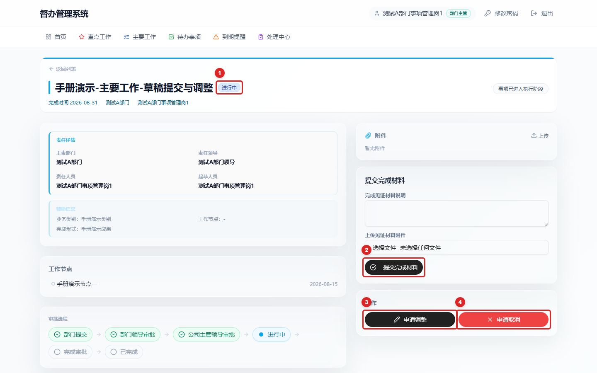

图 11-1 展示进行中事项的办理入口。只有具备办理权限的用户才能看到并使用相应操作。

### 11.2 申请调整

当事项内容需要变更时，系统办理人可以申请调整。

操作步骤：

1. 打开进行中事项。
2. 点击“申请调整”。
3. 填写调整原因。
4. 修改允许调整的事项内容。
5. 点击“提交调整申请”。
6. 调整申请进入审批流程。
7. 审批通过后，事项回到进行中。

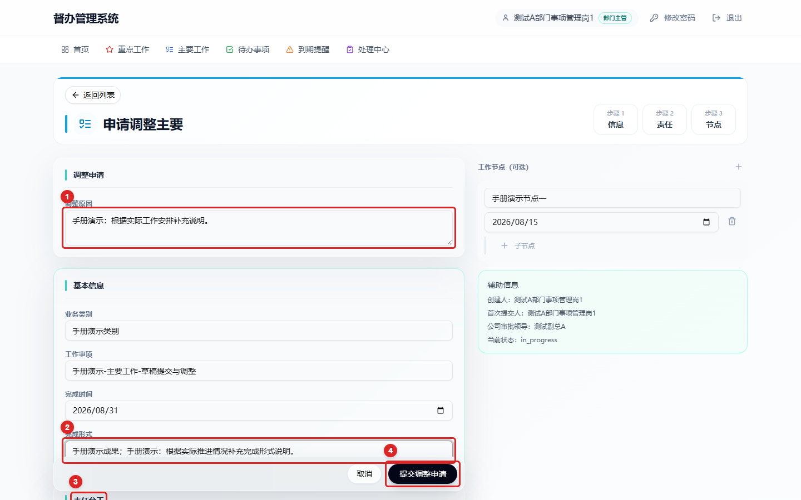

图 11-2 展示调整原因、可调整内容和“提交调整申请”按钮。调整提交后，应等待审批结果。

### 11.3 申请取消

当事项不再需要继续实施时，系统办理人可以申请取消。

操作步骤：

1. 打开进行中事项。
2. 点击“申请取消”。
3. 查看公司审批领导。
4. 填写取消原因。
5. 点击“提交取消申请”。
6. 取消申请进入审批流程。
7. 审批通过后，事项进入“已取消”。

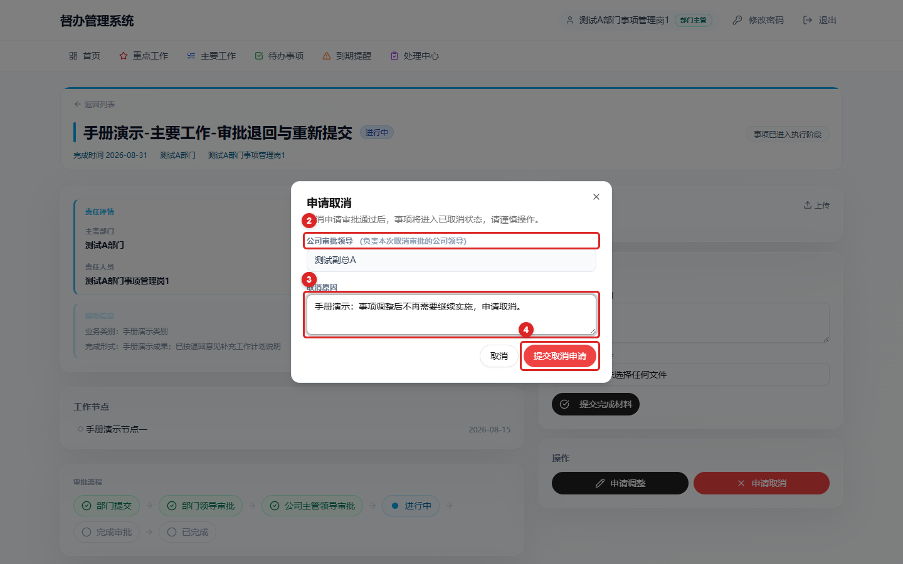

图 11-3 展示申请取消弹窗。取消申请审批通过后，事项结束为已取消状态。

---

## 12. 提交完成材料与完成后查看

### 12.1 提交完成材料

事项处于“进行中”且实际工作已完成后，系统办理人可以提交完成材料，进入完成审批流程。

操作步骤：

1. 打开进行中事项。
2. 在“完成见证材料说明”中填写完成说明。
3. 上传见证材料附件。
4. 点击“提交完成材料”。
5. 事项进入完成审批流程。
6. 审批通过后，事项进入已完成。

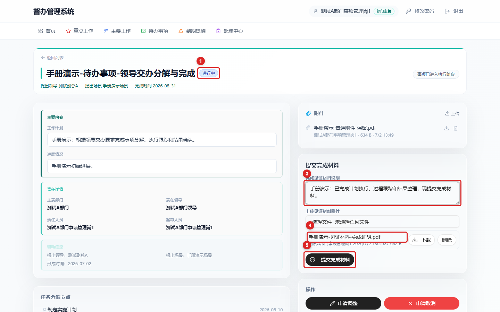

图 12-1 展示完成材料说明、见证材料附件和“提交完成材料”按钮。提交前应确认材料完整。

### 12.2 查看完成结果和见证材料

事项完成后，详情页会显示已完成状态，并保留完成材料和见证材料附件。

用户可以查看：

- 已完成状态；
- 完成材料说明；
- 见证材料附件；
- 下载入口。

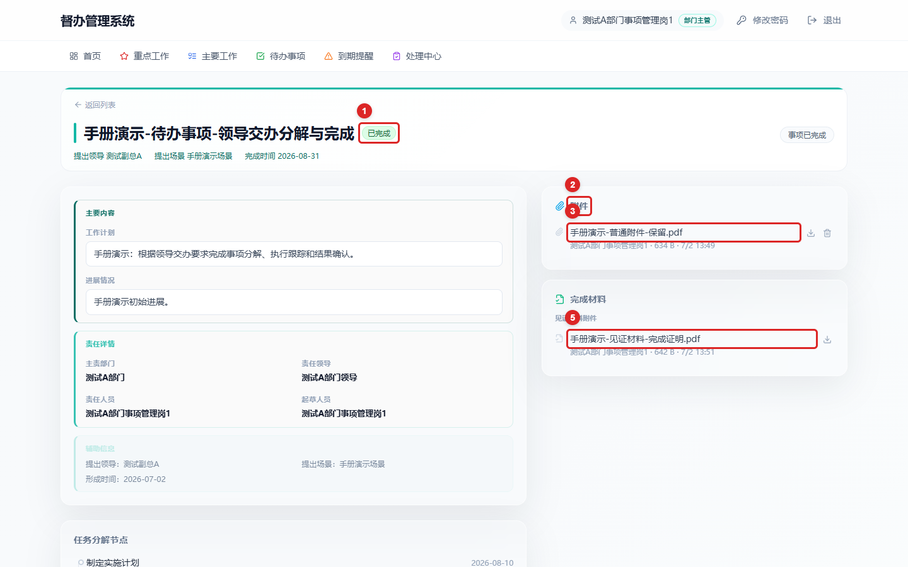

图 12-2 展示已完成事项中的普通附件和见证材料附件。用户可以通过下载入口查看材料。

---

## 13. 普通附件与审批记录

### 13.1 管理普通附件

普通附件用于补充事项过程中的相关材料，不等同于完成材料。

常用操作包括：

1. 点击普通附件区域的“上传”。
2. 选择文件并上传。
3. 在附件列表中点击下载入口查看附件。
4. 对本人上传的附件，可以使用删除入口删除。

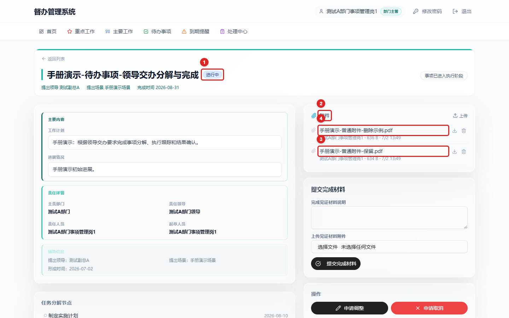

图 13-1 展示普通附件上传后的附件列表、下载入口和删除入口。用户只能删除本人上传且页面允许删除的附件。

> **提示：** 已完成或已取消事项不能继续上传普通附件。

### 13.2 查看审批记录

审批记录用于查看事项流转过程，帮助用户了解事项经过了哪些环节。

审批记录通常可以帮助用户查看：

- 何时提交；
- 谁进行了审批；
- 审批意见；
- 状态如何流转；
- 是否提交过完成材料。

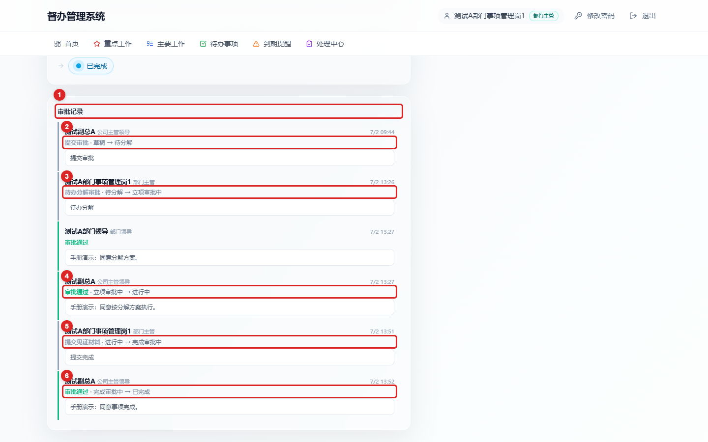

图 13-2 展示事项审批记录。用户可以通过记录了解事项从提交、分解、审批到完成的完整过程。

---

## 14. 常见问题

### 14.1 为什么我能看到事项，却没有编辑或办理按钮？

能查看事项，只代表你有查看权限。编辑、办理、提交、调整、取消、完成等操作需要系统判断你是否是当前应办理的用户，以及事项是否处于允许办理的状态。

### 14.2 为什么我看得到本部门事项，却不能审批？

部门领导可以查看本部门相关事项，但只有事项进入本人审批节点时，页面才会显示审批操作。能查看不等于能审批。

### 14.3 业务责任人和系统办理人有什么区别？

业务责任人用于页面展示和责任留痕。系统办理人负责进行中事项的调整、取消和完成材料提交等操作。草稿编辑、退回后修改和重新提交，由页面显示可办理入口的用户继续处理。两者可以相同，也可以不同。

### 14.4 提交审批后为什么没有确认弹窗？

系统实际行为是：点击“提交审批”后直接提交，并显示“已提交审批”提示。因此提交前应先检查事项内容是否完整、准确。

### 14.5 待我审批和待我办理有什么区别？

待我审批表示事项正在等待本人审批。待我办理表示事项需要本人继续处理，但不一定是审批，例如草稿编辑、待办分解、退回后修改、进行中办理等。

### 14.6 公司领导发起的待办为什么不能直接进入进行中？

公司领导发起待办后，主责部门还需要补充分解方案，包括工作计划、完成时间和任务节点。分解方案提交并审批通过后，事项才会进入进行中。

### 14.7 退回后由谁修改和重新提交？

退回后，由系统指定的办理人查看退回原因、修改事项并重新提交。同部门其他用户即使可以查看，也不一定有重新提交权限。

### 14.8 为什么完成后不能继续上传普通附件？

事项完成后，流程已经结束，页面不再提供继续上传普通附件的入口。完成后的材料主要用于查看和留痕。

### 14.9 为什么我不能删除其他人上传的附件？

普通用户只能删除本人上传且页面允许删除的附件。其他人上传的附件通常只能查看或下载，不能删除。

### 14.10 如何查看事项已经经过哪些审批环节？

打开事项详情页，查看“审批记录”区域。审批记录会显示提交、审批、退回、分解、提交完成材料等关键操作，以及对应的操作人、时间、意见和状态变化。
